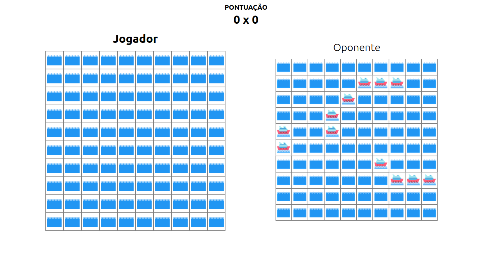

# Batalha Naval

**Número da Lista**: X<br>
**Conteúdo da Disciplina**: Grafos 1<br>

## Alunos
|Matrícula | Aluno |
| -- | -- |
| 202016847  |  Luciano de Freitas Melo |
| 202016945  |  Maria Eduarda dos Santos Abritta Ferreira |

## Sobre 
Vídeo explicativo: https://youtu.be/6JiOqzf1rQM

O vídeo também está disponível [nesse repositório](https://raw.githubusercontent.com/projeto-de-algoritmos/Grafos1_Batalha_Naval/master/src/assets/Grafos1%20Batalha%20Naval.mp4).

O objetivo do projeto foi aplicar os conceitos aprendidos de grafos em um jogo de batalha naval. O jogo consiste em um tabuleiro de 10x10, onde cada jogador tem 6 navios de tamanhos diferentes. Cada jogador deve tentar acertar os navios do adversário. O jogo acaba quando um dos jogadores acertar todos os navios do adversário.

Foram aplicados os conceitos de matriz de adjacência e busca em largura para a implementação do jogo.

## Screenshots



## Instalação 
**Linguagem**: Javascript<br>
**Framework**: Vite + React<br>

O projeto pode ser acessado através do link: https://projeto-de-algoritmos.github.io/Grafos1_Batalha_Naval/

### Usando no ambiente de desenvolvimento local

Clonar o repositório do projeto:

```
git clone https://github.com/projeto-de-algoritmos/Grafos1_Batalha_Naval.git

```

Abrir pasta do projeto no terminal:

```
cd Grafos1_Batalha_Naval
```

Instalar as dependências e rodar o projeto: 

```
npm install
npm run dev
```

O projeto abrirá na url:
http://localhost:3000/Grafos1_Batalha_Naval/

## Uso 
O jogador escolhe uma das casas do tabuleiro para atirar. Se acertar um navio, a casa ficará com a figura de um navio. Se errar, a casa ficará azul. Após isso, o jogador deve esperar o oponente realizar sua jogada para poder atirar novamente. O jogo acaba quando um dos jogadores acertar todos os navios do adversário.

